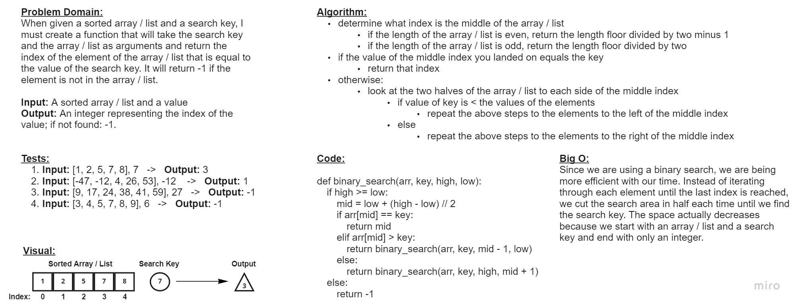

# Code Challenge 03 - Array Binary Search
* Write a function that takes an array / list and a search key as arguments and returns the index of the element of the array / list that is equal to the value of the search key. It will return -1 if the element is not in the array / list.

## Whiteboard Process

## Approach & Efficiency
* For this Code Challenge, a binary search was used to complete the task. This made the time used for the Big O more efficient. Instead of iterating through each element until the last index is reached, we cut the search area in half each time until we find the search key. The space actually decreases because we start with an array / list and a search key and end with only an integer.
