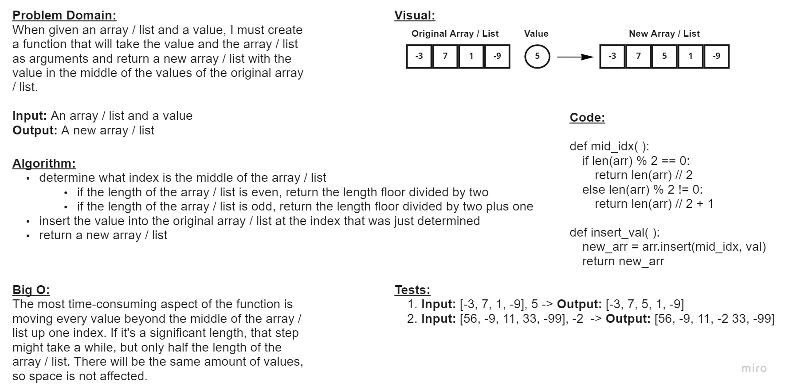

# Code Challenge 02 - Array Insert Shift
* Write a function that takes an array / list and a value as arguments. Return a new array / list with the value added at the middle index.

## Whiteboard Process

## Approach & Efficiency
* I decided to find the middle index of the original array / list by first determining if its length was an odd or even number. If it was an odd number, I had to add one to make it work with the new array / list. Then I inserted the value into the original array / list using the number I previously determined as the index the value will be inserted at.

 

The Big O time will depend on the size of the array / list. It could take long, but it is only half the length of the array / list, since each value after the middle index needs to be moved up one index. The space will not increase because the number of values are the same before and after.
