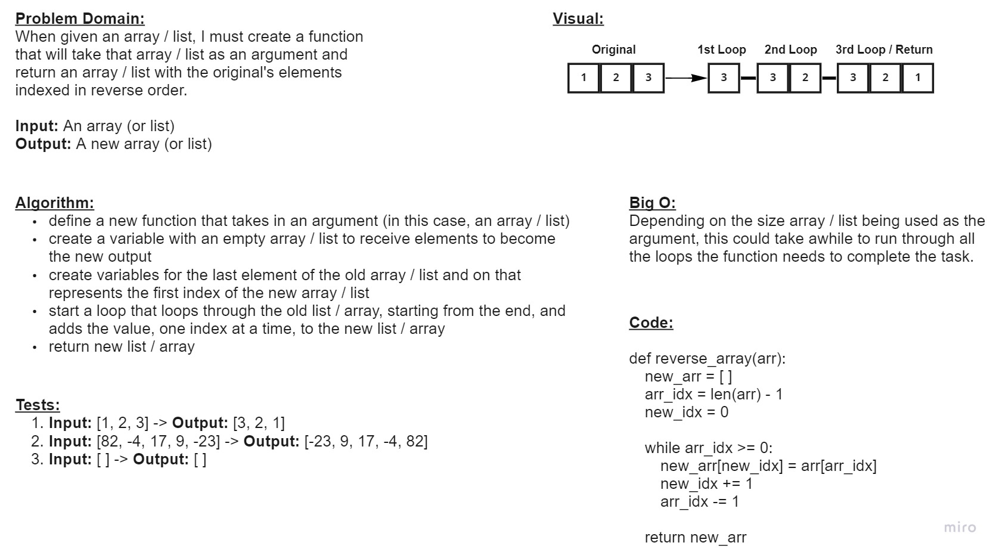

# Code Challenge 01 - Array Reverse
* Write a function that takes an array as an argument. Without utilizing any of the built-in methods available to your language, return an array with elements in reversed order.

## Whiteboard Process

## Approach & Efficiency
* I decided to loop through the original array / list, starting from the last element, and insert the value into the new array / list on index at a time. The Big O time will depend on the size of the array / list used as the argument in the function. The space will be the same size as the original array / list.
